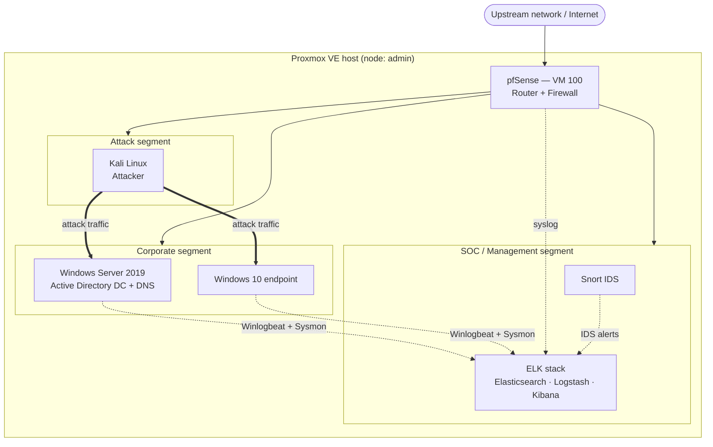

# Local SOC Sandbox Environment Setup (Home SOC Lab)

> **AI disclosure:** AI assistance was used for **documentation only** — structuring, formatting and writing this README from the author's screenshots and notes. The lab design, network layout, installation, configuration, hardening and all testing/attack exercises were performed manually by the author. No AI tool was used to build, configure or operate any part of the lab.

---

## 1. Overview

This is a home **Security Operations Center (SOC)** lab built on a single **Proxmox VE** host. It is an isolated, self-contained environment used to practice the full defender workflow end to end:

1. **Attack** — generate real adversary traffic from a Kali Linux attacker box.
2. **Detect** — catch it with a Snort intrusion detection system on the network, and Sysmon/Windows event logging on the endpoints.
3. **Collect & analyse** — ship every log source into an ELK stack (Elasticsearch, Logstash, Kibana) and triage alerts on dashboards.
4. **Contain** — segment and block traffic at the pfSense router/firewall that sits in front of the whole lab.

The lab mirrors a small enterprise network: an Active Directory domain with a domain controller and a joined Windows 10 endpoint, a segregated attacker network, a SOC/management network for the security tooling, and a perimeter firewall routing and filtering between them.

### Lab components at a glance

| Role | Machine | Purpose in the lab |
|------|---------|--------------------|
| Router / firewall | **pfSense** | Perimeter gateway, VLAN/segment routing, firewall rules, NAT, syslog source |
| Logging / SIEM | **ELK stack** (Elasticsearch, Logstash, Kibana) | Central log ingestion, parsing/enrichment, storage, search and dashboards |
| Intrusion detection | **Snort** | Signature-based network IDS, alerting on attacker traffic |
| Attacker | **Kali Linux** | Offensive test box used to generate malicious traffic and AD attacks |
| Endpoint | **Windows 10** | Domain-joined user workstation, primary victim/telemetry source |
| Identity / directory | **Windows Server 2019** | Active Directory Domain Controller, DNS, GPO, user/computer accounts |
| Hypervisor | **Proxmox VE** | Hosts all of the above as VMs |

### Document status legend

Every fact in this document is marked so that nothing unverified is presented as recorded:

| Marker | Meaning |
|--------|---------|
| **Recorded** | Verified directly from the author's Proxmox console, screenshots or task logs |
| **To confirm** | Planned or provisional value — replace with the real one once captured |

---

## 2. Lab architecture

### 2.1 Topology

### 2.2 Network design

The lab is split into three segments so that the attacker network can be isolated from the corporate network at the firewall, and so that IDS visibility can be placed deliberately. **Status: To confirm** — the addressing below is the working scheme; adjust it to match what was actually configured.

| Segment / VLAN | Subnet | pfSense interface | Members | Trust level |
|----------------|--------|-------------------|---------|-------------|
| WAN (upstream) | DHCP | `em0` | Proxmox bridge `vmbr0` | Untrusted |
| SOC / Management | `10.10.10.0/24` | `OPT1` → `10.10.10.1` | ELK stack, Snort | Trusted (defenders only) |
| Corporate LAN | `10.10.20.0/24` | `OPT2` → `10.10.20.1` | Windows Server 2019 DC, Windows 10 | Trusted (monitored) |
| Attack / Rogue | `10.10.30.0/24` | `OPT3` → `10.10.30.1` | Kali Linux | **Untrusted** (isolated) |

### 2.3 Planned IP allocation

**Status: To confirm.**

| Host | Segment | IP | Gateway | DNS | Notes |
|------|---------|----|---------|-----|-------|
| pfSense WAN | upstream | DHCP | upstream | upstream | `em0`, DHCP client, VLAN tagging disabled (**Recorded**) |
| pfSense SOC | SOC | `10.10.10.1` | — | — | |
| pfSense Corporate | Corporate | `10.10.20.1` | — | — | |
| pfSense Attack | Attack | `10.10.30.1` | — | — | |
| ELK stack | SOC | `10.10.10.10` | `10.10.10.1` | DC | Kibana web UI on `:5601`, Elasticsearch on `:9200` |
| Snort | SOC | `10.10.10.11` | `10.10.10.1` | DC | Second NIC in promiscuous/monitor mode |
| Windows Server 2019 DC | Corporate | `10.10.20.10` | `10.10.20.1` | itself (AD DNS) | Static IP required for a DC |
| Windows 10 endpoint | Corporate | `10.10.20.50` | `10.10.20.1` | `10.10.20.10` | Domain joined |
| Kali Linux | Attack | `10.10.30.20` | `10.10.30.1` | `10.10.20.10` or public | Isolated from Corporate by firewall rules |

### 2.4 Log and telemetry flow

| Source | Agent / method | Transport | Destination | What it provides |
|--------|----------------|-----------|-------------|------------------|
| Windows Server 2019 | Winlogbeat + Sysmon | TCP/TLS `:5044` or HTTP `:9200` | Logstash → Elasticsearch | Security, System, PowerShell, AD, Kerberos/NTLM events |
| Windows 10 | Winlogbeat + Sysmon | TCP/TLS `:5044` | Logstash → Elasticsearch | Process creation, logon events, Sysmon EIDs |
| pfSense | syslog | UDP `:514` | Logstash → Elasticsearch | Firewall block/pass, NAT, VPN, DHCP events |
| Snort | alerts (`fast`/`json`) + Filebeat | file → Beats, or syslog | Logstash → Elasticsearch | IDS signature hits with full 5-tuple |
| ELK / Linux hosts | Filebeat (system, auth, audit) | TCP/TLS `:5044` | Logstash → Elasticsearch | Host-level visibility on the SOC segment |

Pipeline: **Beats/syslog → Logstash (filter, grok, GeoIP, enrich with AD data) → Elasticsearch (index per source, ILM rollover) → Kibana (dashboards, Discover, alerting)**.

### 2.5 Key firewall rules (pfSense)

**Status: To confirm** — record the actual rule set once built.

| # | Interface | Source | Destination | Port / protocol | Action | Rationale |
|---|-----------|--------|-------------|-----------------|--------|-----------|
| 1 | WAN | any | any | any | **Block** (default) | No inbound from upstream |
| 2 | Attack | Kali | Corporate | any | **Allow** (lab window only) | Permits test attacks to be generated |
| 3 | Attack | Kali | SOC | any | **Block** | Attacker must never reach the SIEM |
| 4 | Attack | Kali | WAN | any | Allow / block as desired | Controls internet access for the attacker box |
| 5 | Corporate | DC | SOC (ELK) | `5044`, `9200` | Allow | Log shipping only |
| 6 | Corporate | Win10 | SOC (ELK) | `5044` | Allow | Log shipping only |
| 7 | Corporate | any | DC | `53`, `88`, `389`, `445`, `636` | Allow | DNS, Kerberos, LDAP, SMB |
| 8 | SOC | any | Corporate | any | **Block** except log collection | Defenders do not initiate into Corporate |
| 9 | SOC | admin host | all | `443`, `22`, `5601` | Allow | Management access only |
| 10 | All | any | any | any | Log to syslog → ELK | Visibility of every decision |

---

## 3. Virtual machines

### 3.1 VM inventory

**Status: pfSense is Recorded; the rest are To confirm** — fill in VM IDs, resources and disk sizes from the Proxmox GUI.

| VM ID | Name | OS / role | vCPU | RAM | Disk | NICs | Status |
|-------|------|-----------|------|-----|------|------|--------|
| 100 | PFSense | pfSense — router/firewall | 1 | 1024 MiB | 32 GB (`local-lvm`) | E1000, `vmbr0`, tag 1 | **Recorded** |
| To confirm | ELK / SIEM | Ubuntu — Elasticsearch, Logstash, Kibana | To confirm (4+) | To confirm (8–16 GiB) | To confirm (100 GB+) | VirtIO, SOC segment | To confirm |
| To confirm | Snort | Ubuntu — Snort IDS | To confirm (2+) | To confirm (2–4 GiB) | To confirm (32 GB+) | mgmt NIC + monitor NIC | To confirm |
| To confirm | Kali | Kali Linux — attacker | To confirm (2) | To confirm (4 GiB) | To confirm (40 GB+) | VirtIO/E1000, Attack segment | To confirm |
| To confirm | Win10 | Windows 10 — endpoint | To confirm (2) | To confirm (4 GiB) | To confirm (60 GB+) | VirtIO, Corporate segment | To confirm |
| To confirm | DC01 | Windows Server 2019 — AD DC | To confirm (2) | To confirm (4 GiB) | To confirm (60 GB+) | VirtIO, Corporate segment | To confirm |

> **Sizing note:** Elasticsearch is the hungriest component in this lab — give the ELK VM the largest share of host RAM (heap roughly 50% of VM RAM, capped at 31 GB) and fast storage. The DC and Windows 10 boxes run fine on modest allocations. Confirm the host's total RAM before finalising these numbers.

### 3.2 VM 100: PFSense — Recorded

| Setting | Value |
|---------|-------|
| VM ID / Name | 100 / PFSense |
| Node | admin |
| Memory | 1024 MiB (1.00 GiB) |
| Processors | 1 socket, 1 core, type `x86-64-v2-AES` |
| BIOS / Machine | SeaBIOS (Default) / i440fx (Default) |
| SCSI controller | VirtIO SCSI single |
| Disk | `local-lvm:vm-100-disk-0`, 32 GB |
| CD/DVD | `local:iso/netgate-installer-v1.2-RELEASE-amd64.iso` |
| Guest OS type | Other |
| Network device | Intel E1000, bridge `vmbr0`, VLAN tag `1`, firewall flag enabled |

### 3.3 Host

| Component | Details | Status |
|-----------|---------|--------|
| Hypervisor | Proxmox Virtual Environment **9.2.2**, node name `admin` | Recorded |
| Host management network | Linux bridge `vmbr0` on physical NIC `nic0` (Active, Autostart) | Recorded |
| Storage | `local` (ISO images and templates), `local-lvm` (VM disks) | Recorded |
| Additional bridges / VLAN-aware bridge | To confirm — needed to carry the SOC, Corporate and Attack segments | To confirm |
| Backups | To confirm (Proxmox Backup Server, vzdump schedule, snapshots before each exercise) | To confirm |

---

## 4. Components

### 4.1 pfSense — router and firewall

**Role:** the perimeter of the lab. Everything in and out of the lab passes through pfSense, which performs inter-VLAN routing, NAT, firewall filtering and logging. It is also a log source in its own right (syslog of firewall decisions to ELK) and the enforcement point for isolating the Kali attacker segment.

**Status:** Recorded through installation start; interface assignment onward To confirm.

Key configuration to capture:

- WAN interface `em0` — DHCP client, VLAN tagging disabled, local resolver not used (**Recorded**).
- LAN/OPT interfaces for the three lab segments, created as VLANs on a single trunk NIC or as separate virtual NICs (**To confirm**).
- DHCP: disabled on the Attack segment (static Kali IP) and on Corporate for servers; the DC hands out addresses via its own DHCP role if used (**To confirm**).
- Firewall rules per §2.5, with **logging enabled on the rules that matter** so ELK receives them.
- `System > Advanced > Admin Access`: disable HTTP, use HTTPS on a non-default port, restrict to the SOC segment (**To confirm**).
- Packages of interest: `pfBlockerNG` (threat feeds / blocklists), `Snort` (if IDS is run inline on pfSense instead of as its own VM), `ntopng` (traffic visibility).

### 4.2 ELK stack — logging and analysis (SIEM)

**Role:** the SOC's eyes. All log sources land here; Kibana is where alerts are triaged, hunts are run and dashboards are built.

**Status: To confirm** — record the actual version, install method and VM details.

| Item | Value |
|------|-------|
| Distribution | To confirm (Ubuntu 22.04 / 24.04 LTS typical) |
| Elastic Stack version | To confirm (8.x) |
| Install method | To confirm (APT packages + systemd, or Docker Compose) |
| Components | Elasticsearch, Logstash, Kibana, plus Beats on the sources |
| Index strategy | To confirm (one data stream/index per source, ILM rollover by size and age) |
| Security | To confirm (Elastic security enabled, TLS, RBAC users, Kibana restricted to the SOC segment) |

Pipeline design:

1. **Beats layer** — Winlogbeat on Windows Server 2019 and Windows 10, Filebeat on pfSense log collectors, Snort and the ELK host itself.
2. **Logstash layer** — TCP/TLS Beats input on `:5044`; per-source pipelines that grok and normalise pfSense and Snort logs, map Windows Event IDs to readable fields, enrich with GeoIP for WAN traffic and with AD user/computer metadata where useful.
3. **Elasticsearch layer** — indices such as `logs-windows.*`, `logs-sysmon.*`, `logs-pfsense.*`, `logs-snort.*`, `logs-linux.*`; ILM to keep the lab's disk usage bounded.
4. **Kibana layer** — dashboards for: logon success/failure and account lockouts, process creation from Sysmon, firewall blocks by source, IDS alerts by signature/severity, and an "attack window" overview used during exercises. Alerting rules for high-signal events (Kerberoasting service-ticket requests, LSASS access, mass SMB failures, new user creation).

Useful Sysmon event IDs to hunt on: `1` (process creation), `3` (network connection), `7` (image load), `8` (CreateRemoteThread), `10` (ProcessAccess — LSASS), `11` (file create), `13` (registry value set), `22` (DNS query).

### 4.3 Snort — intrusion detection system

**Role:** network-based detection. Snort inspects traffic crossing the lab segments and raises signature alerts, which are shipped to ELK so they appear alongside endpoint telemetry.

**Status: To confirm.**

| Item | Value |
|------|-------|
| Snort version | To confirm (Snort 3.x) |
| Host | To confirm — dedicated Ubuntu VM, or the pfSense `Snort` package |
| Ruleset | To confirm — Talos Registered rules (`snort3` community/registered), plus custom local rules |
| Capture method | To confirm — inline on the pfSense-facing interface, or a mirrored/spanned lab segment |
| Output | To confirm — `alert_fast`/unified2 and JSON alerts, collected by Filebeat into Logstash |
| Tuning | To confirm — suppressions for lab noise (DHCP, DNS, SMB broadcasts, Windows telemetry) |

Notes:

- A **second NIC in monitor mode** on the Snort VM is the cleanest layout when the sensor is a VM: NIC 1 on the SOC segment for management and log shipping, NIC 2 attached to the traffic it inspects.
- If Snort runs as the **pfSense package** instead, it can operate inline (IPS mode, blocking as well as alerting) with no extra VM — decide which approach was taken and record it.
- Alerts should be correlated with Sysmon events in Kibana: an IDS hit on `445` from Kali plus a Sysmon `EID 1` `psexec`-style process creation on the target is the whole story of one attack.

### 4.4 Kali Linux — attacker

**Role:** the red-team box. Generates the malicious traffic and Active Directory attacks that the SOC side is meant to detect. Kept on its own segment so it can be cut off from the rest of the lab with a single firewall rule.

**Status: To confirm.**

| Item | Value |
|------|-------|
| Release | To confirm (rolling, e.g. 2025.x) |
| Install | To confirm — ISO on Proxmox, or the Proxmox LXC template |
| Segment | Attack `10.10.30.0/24` (**To confirm**) |
| Outbound internet | To confirm — allowed for tooling updates, blocked during exercises if desired |

Tooling used in exercises (To confirm the exact set):

| Category | Tools |
|-----------|-------|
| Recon / enumeration | `nmap`, `masscan`, `responder`, `bloodhound`/`bloodhound-python`, `enum4linux-ng`, `ldapsearch` |
| AD attacks | `impacket` (GetUserSPNs, secretsdump, psexec, wmiexec, ntlmrelayx), `kerbrute`, `netexec`/`crackmapexec`, `rubeus`-equivalents |
| Credential access | `mimikatz` (on the Windows side), `hashcat`, `john` |
| Exploitation / C2 | Metasploit, `msfvenom`, PowerShell Empire / Sliver (To confirm) |
| Web / other | `burpsuite`, `hydra`, `sqlmap` |

**Safety rules for the attacker box (record and follow):**

1. The Kali VM has **no route to the SOC segment** — never attack the SIEM that is recording you.
2. Attacks run only against the Corporate segment, and only inside a declared lab window.
3. Everything is isolated behind pfSense; the lab never touches production networks or the internet as an attack source.
4. Snapshots of the targets are taken before each exercise so the lab can be reverted.

### 4.5 Windows 10 — endpoint

**Role:** the user workstation and the primary target/victim in exercises. Also the richest telemetry source in the lab once Sysmon and Winlogbeat are installed.

**Status: To confirm.**

| Item | Value |
|------|-------|
| Edition / build | To confirm (Windows 10 Pro/Education, build number) |
| Domain | To confirm (e.g. `soclab.local`) |
| Segment | Corporate `10.10.20.0/24` |
| Hostname | To confirm (e.g. `WS01`) |
| Telemetry agents | Sysmon (**To confirm** config — SwiftOnSecurity or Olaf Hartong moderate), Winlogbeat (**To confirm** version) |
| Additional logging | PowerShell script-block and module logging, command-line auditing, Windows Defender logs (To confirm) |
| Snapshot | Take a clean pre-attack snapshot after agents are installed |

Enable on the endpoint: **Audit process creation with command line** (GPO or local policy), **PowerShell script block logging**, **Windows Defender event logging**, and Windows Firewall logging where useful.

### 4.6 Windows Server 2019 — Active Directory

**Role:** identity and directory services — the thing an attacker wants to own and the thing a SOC most needs visibility into. Runs AD DS, DNS for the domain, and Group Policy (including the policy that pushes Sysmon and Winlogbeat to the endpoint).

**Status: To confirm.**

| Item | Value |
|------|-------|
| Role | Active Directory Domain Services, DNS |
| Domain / forest name | To confirm (e.g. `soclab.local`) |
| Domain & forest functional level | To confirm (Windows Server 2016/2019) |
| Hostname | To confirm (e.g. `DC01`) |
| IP | Static `10.10.20.10`, DNS pointing at itself (**To confirm**) |
| Segment | Corporate `10.10.20.0/24` |
| Telemetry agents | Sysmon, Winlogbeat (To confirm) |

Directory design to build and record:

- **OUs**: `Servers`, `Workstations`, `Users`, `Service Accounts`, `Groups` — separation makes GPO targeting and BloodHound output readable.
- **Accounts**: a handful of realistic user accounts with different privileges, a Domain Admin, and deliberately weak/service accounts (SPNs) so Kerberoasting has something to find. **Record which accounts are "bait" so detections can be validated.**
- **GPOs**: push Sysmon (with a chosen config) and Winlogbeat to the `Workstations` OU; enable advanced audit policies (logon/logoff, account management, DS access, object access, privilege use); configure PowerShell logging.
- **Advanced audit policy** on the DC is what makes Kerberos (`4768`/`4769`), NTLM (`4776`), account management (`4720`, `4728`, `4732`) and logon (`4624`/`4625`/`4648`) events useful in Kibana.
- Consider adding **Sysmon for AD-relevant events** and, later, an ATA-like detection layer or Microsoft Defender for Identity in a lab edition (To confirm).

---

## 5. Software used

| Software | Version | Purpose | Status |
|----------|---------|---------|--------|
| Proxmox Virtual Environment | 9.2.2 | Hypervisor and VM management | Recorded |
| pfSense (Netgate Installer) | v1.2-RELEASE (amd64 ISO, ~1010 MiB) | Firewall / router VM | Recorded |
| Elasticsearch | To confirm (8.x) | Log storage and search | To confirm |
| Logstash | To confirm | Log parsing, filtering, enrichment | To confirm |
| Kibana | To confirm | Dashboards, alerting, triage UI | To confirm |
| Winlogbeat | To confirm | Windows event shipping | To confirm |
| Filebeat | To confirm | Snort/pfSense/Linux log shipping | To confirm |
| Sysmon | To confirm | Deep Windows endpoint telemetry | To confirm |
| Snort | To confirm (3.x) | Network intrusion detection | To confirm |
| Kali Linux | To confirm | Attacker platform | To confirm |
| Windows 10 | To confirm | Endpoint / victim | To confirm |
| Windows Server 2019 | To confirm | Active Directory DC and DNS | To confirm |
| Talos IDS rules | To confirm | Snort signature ruleset | To confirm |

---

## 6. Setup steps

### 6.1 Download the pfSense installer ISO — Recorded

- In Proxmox, open **admin > local > ISO Images** and choose **Download from URL**.
- The ISO was downloaded from the Netgate download server (`shop.netgate.com`). The task log records a file of 342,781,760 bytes, decompressed to `netgate-installer-v1.2-RELEASE-amd64.iso`.
- The task completed successfully (**TASK OK**, 19.4 MB/s average, 2026-09-15 18:03:43).
- The ISO appears in the `local` ISO list.

### 6.2 Review the host bridge (node network) — Recorded

- Go to **admin > System > Network**. The **Create** menu offers Linux Bridge, Linux Bond, Linux VLAN, OVS Bridge, OVS Bond, and OVS IntPort.
- The host's existing network is a **Linux Bridge** (Active: Yes, Autostart: Yes) with port `nic0`. The VM's NIC is attached to `vmbr0`.

### 6.3 Create the pfSense VM — Recorded

1. **Create VM** > **General**: Node `admin`, VM ID `100`, Name `PFSense`. "Add to HA" left unchecked.
2. **OS**: Use CD/DVD disc image (ISO) from storage `local`, image `netgate-installer-v1.2-RELEASE-amd64.iso`. Guest OS Type **Other**, Version `-`.
3. **System**: Default settings (SeaBIOS, i440fx, VirtIO SCSI single).
4. **Disks**: 32 GB disk on `local-lvm`.
5. **CPU**: 1 socket, 1 core, `x86-64-v2-AES`.
6. **Memory**: **1024 MiB**.
7. **Network**: Intel E1000 network device on bridge **Internal** (as shown in the Add Network Device dialog), VLAN Tag **no VLAN**, Firewall unchecked, MAC auto.
8. **Confirm**, then create the VM.

After creation, the **Hardware** tab shows the NIC as `e1000=<MAC>,bridge=vmbr0,firewall=1,tag=1`. The saved configuration uses VLAN tag `1` on `vmbr0`, which differs from the "no VLAN" option in the wizard. The Hardware tab is the authoritative record of the NIC settings.

### 6.4 Install pfSense — Recorded (start) / To confirm (finish)

1. Start VM 100 and open **Console**.
2. The Netgate Installer **Welcome** screen offers **Install pfSense**, **Rescue Shell**, **Advanced Options**, and **Cancel**. Choose **Install pfSense**.
3. On the **WAN (em0) Network Mode Setup** screen, the following settings were used:
   - Interface Mode: **DHCP (client)**
   - VLAN Settings: **VLAN Tagging disabled**
   - Use local resolver: **false**
   - Selected: **Continue**

The WAN interface is `em0`, the FreeBSD driver name for the E1000 virtual NIC.

Remaining pfSense work (**To confirm**): assign the LAN/OPT interfaces, create the three lab VLANs, set interface IPs and DHCP, apply the firewall rules in §2.5, enable syslog forwarding to ELK, and restrict admin access to the SOC segment.

### 6.5 Build the segments — To confirm

1. Make `vmbr0` **VLAN-aware** (or create additional bridges) on the Proxmox host.
2. Attach each VM's NIC with the VLAN tag for its segment; give Snort a second NIC on the traffic it monitors.
3. Verify isolation before installing anything else: Kali should not be able to reach ELK.

### 6.6 Windows Server 2019 → Active Directory — To confirm

1. Create the VM (VirtIO disk and NIC drivers from the VirtIO ISO; guest OS type **Microsoft Windows 10/2016/2019**).
2. Install Windows Server 2019, set a static IP and hostname, then **Add Roles and Features → Active Directory Domain Services** and **DNS Server**.
3. **Promote to a domain controller**, create a new forest (domain name To confirm), set DSRM password.
4. Build OUs, users, groups and service accounts (§4.6).
5. Configure **Advanced Audit Policy** via GPO, then create the GPO that deploys Sysmon and Winlogbeat to workstations.
6. Install Sysmon and Winlogbeat locally, verify events appear in Kibana.

### 6.7 Windows 10 endpoint — To confirm

1. Create the VM, install Windows 10, install VirtIO drivers.
2. Point DNS at the DC and **join the domain**; place the computer in the `Workstations` OU so it receives the GPOs.
3. Confirm Sysmon and Winlogbeat were pushed by GPO (install manually if not).
4. Enable PowerShell script-block logging and process-creation command-line auditing.
5. Take a **clean snapshot**, then verify telemetry in Kibana before any attack exercise.

### 6.8 ELK stack — To confirm

1. Create the Ubuntu VM on the SOC segment with the largest RAM allocation in the lab.
2. Install Java if required, then Elasticsearch, Logstash and Kibana (APT repository + systemd, or Docker Compose).
3. Enable Elastic security/TLS, create Beats users and index templates, configure ILM.
4. Build Logstash pipelines per source (§4.2) and the Beats input on `:5044`.
5. Install Kibana dashboards, confirm each source is indexing, then build the triage views.

### 6.9 Snort — To confirm

1. Create the Ubuntu VM with two NICs (SOC management + monitor).
2. Install Snort 3 and its dependencies; download the Talos ruleset (registration required for the Registered rules).
3. Configure `snort.lua`: interfaces, home nets (the three lab subnets), rule paths, and JSON/`alert_fast` output.
4. Run a baseline capture, tune out lab noise with suppressions, then ship alerts to ELK with Filebeat.
5. Validate with known-bad traffic from Kali and confirm the alert shows up in Kibana.

### 6.10 Kali attacker — To confirm

1. Create the VM on the Attack segment (ISO install or LXC template).
2. Update the toolset, set the static IP, confirm DNS resolution of the domain via the DC or public DNS.
3. Verify firewall isolation: no route to the SOC segment, and access to Corporate only per the lab rules.
4. Snapshot before each exercise.

### 6.11 Validation checklist — To confirm

| Check | Expected result | Done |
|-------|-----------------|------|
| pfSense routes between all three segments | pings succeed per policy | ☐ |
| Kali cannot reach ELK/Kibana | blocked and logged | ☐ |
| DC promotes and serves DNS for the domain | `nslookup` of the domain resolves on Win10 | ☐ |
| Win10 joins the domain and receives GPOs | `gpresult /r` shows the SOC GPO | ☐ |
| Sysmon events from Win10 and DC in Kibana | EID 1/3/10 present | ☐ |
| Winlogbeat events in Kibana | Security logon events present | ☐ |
| pfSense syslogs in Kibana | firewall block entries present | ☐ |
| Snort alerts in Kibana | signature hit from an `nmap` scan | ☐ |
| End-to-end test | Kali scan → Snort alert + Sysmon event, correlated in one Kibana view | ☐ |

---

## 7. Lab exercises

**Status: To confirm** — planned exercise list; tick off and document findings as each is run.

| # | Exercise | Attacker action (Kali) | Expected detection |
|---|----------|------------------------|--------------------|
| 1 | Network enumeration | `nmap` service/OS scan of the Corporate segment | Snort scan signatures; firewall logs; Sysmon EID 3 on targets |
| 2 | SMB / NetBIOS abuse | `enum4linux-ng`, `responder`, NTLM relay attempt | Snort SMB signatures; Sysmon EID 1/3; Windows Security `5140`/`5145` |
| 3 | Password spraying & brute force | `netexec`/`kerbrute` against DC and Win10 | `4625` spikes, `4771` Kerberos pre-auth failures, account lockouts `4740` |
| 4 | Kerberoasting | `GetUserSPNs.py` requesting service tickets | `4769` with RC4 encryption (`0x17`), Sysmon EID 1 |
| 5 | Credential dumping | LSASS access (Mimikatz / `secretsdump.py`) | Sysmon EID 10 targeting `lsass.exe`, EID 1, Defender alerts |
| 6 | Lateral movement | `psexec.py`/`wmiexec.py` to Win10 | Sysmon EID 1 (service creation), `4624` type 3, `7045` service install |
| 7 | Persistence | scheduled task / service / Run key | Sysmon EID 1, 12/13/14 registry, `4698` scheduled task created |
| 8 | Data exfiltration | DNS tunnelling / large outbound transfer | Snort signatures, pfSense NAT logs, Sysmon EID 22 DNS queries |
| 9 | Containment | block the attacker at pfSense mid-exercise | firewall block log in Kibana, attack traffic stops |
| 10 | Detection engineering | write a Kibana alerting rule for one of the above, then re-run | alert fires within the rule's threshold |

---

## 8. Screenshots

| # | Screenshot | What it shows |
|---|------------|---------------|
| 1 | Create VM, Memory tab | Memory set to 1024 MiB. Background shows the `local` ISO list with `netgate-installer-v1.2-RELEASE-amd64.iso` (1010.17 MiB). |
| 2 | Add Network Device dialog | Bridge "Internal", model Intel E1000, VLAN Tag "no VLAN", MAC "auto", Firewall unchecked. |
| 3 | VM 100 Hardware tab, Add menu open | Hardware list with 1 GiB memory, 1 core CPU, 32 GB disk, ISO on the CD/DVD drive, and the E1000 NIC on `vmbr0` with tag 1. The Add menu offers Hard Disk, Network Device, CD/DVD, and others. |
| 4 | Node `admin` > System > Network | Network list with the Linux Bridge (Active, Autostart, port `nic0`) and the Create menu open. |
| 5 | Create VM, General tab | Node `admin`, VM ID `100`, Name field, HA unchecked. |
| 6 | Create VM, OS tab | ISO selected from storage `local`, Guest OS type Other. |
| 7 | pfSense installer, Welcome screen | Netgate Installer v1.2-RELEASE welcome dialog with "Install pfSense" highlighted. |
| 8 | pfSense installer, WAN network mode | WAN (em0) set to DHCP (client), VLAN tagging disabled, Continue highlighted. |
| 9 | Proxmox task viewer | ISO download log from `shop.netgate.com`, 342,781,760 bytes, **TASK OK**. |
| 10 | Storage `local` > ISO Images | ISO `netgate-installer-v1.2-RELEASE-amd64.iso` listed (1010.17 MiB, format `iso`). |

Screenshots to add (**To confirm**): pfSense interface assignment and VLAN config, pfSense firewall rule list, Proxmox VM list showing all six VMs, Kibana dashboard overview, a Snort alert in Kibana, the AD Users and Computers OU structure, Win10 domain-join confirmation, and a Sysmon event in Discover.

---

## 9. Issues encountered

### Recorded

- **Failed "Update package database" tasks on the Proxmox node.** Two `apt-get update` tasks failed, on 2026-09-14 at 21:54 and 2026-09-15 at 03:55.
- **Wizard vs. saved NIC configuration mismatch on VM 100.** The network step showed "no VLAN", but the saved hardware shows `tag=1` on `vmbr0`. The Hardware tab is the authoritative record.

### To confirm — capture as they happen

| Component | Issue | Cause | Resolution |
|-----------|-------|-------|------------|
| pfSense | | | |
| ELK stack | (e.g. JVM heap too large, disk watermark flood-stage blocking indexing) | | |
| Snort | (e.g. no alerts due to wrong interface / home nets, alert volume too high) | | |
| Windows Server 2019 | (e.g. DNS misconfiguration blocking domain join, GPO not applying) | | |
| Windows 10 | (e.g. VirtIO drivers missing, Winlogbeat TLS/certificate failure) | | |
| Kali | (e.g. no route to Corporate segment, tools needing update) | | |
| Networking | (e.g. VLAN-aware bridge not passing tags, asymmetric routing) | | |

---

## 10. Lessons learned

- **Check the NIC tag after creating a VM.** The wizard offered "no VLAN", but the saved NIC has `tag=1`. The Hardware tab shows the final configuration.
- **Verify ISO checksums.** The download task log records the transfer. Compare the ISO against Netgate's published hash before installing.
- **Segment before you install.** Getting the VLANs and firewall rules right first means every later component lands on the correct network, and the attacker box is isolated from the SIEM by default.
- **Isolate the attacker from the SOC segment.** Kali must never be able to reach Elasticsearch or Kibana — otherwise the tooling recording the exercise becomes part of the attack surface.
- **The DC's IP must be static, and clients must point at it for DNS.** Most Active Directory problems in a home lab are DNS problems.
- **Baseline before you attack.** Capture what "normal" looks like in Kibana first; without a baseline, every detection is guesswork and tuning Snort is impossible.
- **Tune the IDS for lab noise.** Untuned Snort in an AD lab produces a wall of SMB/DNS/Kerberos alerts that hides the real findings.
- **Snapshot relentlessly.** A clean snapshot of each target before an exercise is the difference between a repeatable lab and a rebuild.
- **Watch Elasticsearch disk usage.** ILM policies matter even in a small lab — the flood-stage watermark will make indices read-only.
- **Detection needs both layers.** Network IDS alone misses fileless and in-memory attacks; Sysmon alone misses the traffic before it lands. The correlation in Kibana is where the value is.

---

## 11. Next steps

- [ ] Finish the pfSense installation and assign the LAN/OPT interfaces.
- [ ] Make `vmbr0` VLAN-aware and create the SOC, Corporate and Attack segments.
- [ ] Define and apply the pfSense firewall rules (§2.5) with logging enabled.
- [ ] Deploy the ELK stack VM, secure it, and build the Logstash pipelines and Kibana dashboards.
- [ ] Build the Windows Server 2019 DC: AD DS, DNS, OUs, accounts, advanced audit policy, GPOs.
- [ ] Join the Windows 10 endpoint to the domain and deploy Sysmon + Winlogbeat via GPO.
- [ ] Install and tune Snort, ship alerts to ELK, validate against an `nmap` scan from Kali.
- [ ] Stand up the Kali attacker VM and verify segment isolation.
- [ ] Run the validation checklist (§6.11) end to end.
- [ ] Execute and document the lab exercises in §7, with findings and screenshots.
- [ ] Add the outstanding screenshots (§8) and fill in every **To confirm** value.
- [ ] Later: Proxmox backup schedule, pfBlockerNG threat feeds, Windows Defender / Sysmon-AD detection content, a second DC or a Windows 11 endpoint.

---

## 12. Scope and safety

This lab is an **isolated training environment on a single Proxmox host** behind a pfSense firewall. Offensive tooling (Kali, Impacket, Mimikatz-class credential access) is used **only** against lab VMs that the author owns and controls, on private RFC1918 lab subnets, with no routing to production networks and no use of these techniques against any third-party system. Any internet-facing attack traffic is blocked at the firewall. The purpose is defensive skill development: understanding how attacks appear in logs so they can be detected, triaged and contained.

---

*Documentation written with AI assistance (documentation only). All lab design, build and testing performed manually by the author.*
