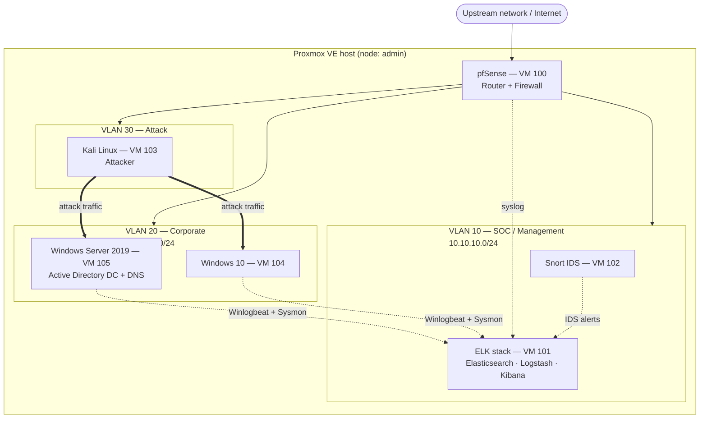

# Local SOC Sandbox Environment Setup (Home SOC Lab)

> **AI disclosure:** AI assistance was used for **documentation only** — structuring, formatting and writing this README from the author's screenshots and notes. The lab design, network layout, installation, configuration, hardening and all completed testing/attack exercises were performed manually by the author. No AI tool was used to build, configure or operate any part of the lab.

---

## 1. Overview

This is a home **Security Operations Center (SOC)** lab built on a single **Proxmox VE** host. It is an isolated, self-contained environment used to practice the full defender workflow end to end:

1. **Attack** — generate real adversary traffic from a Kali Linux attacker box.
2. **Detect** — catch it with a Snort intrusion detection system on the network, and Sysmon/Windows event logging on the endpoints.
3. **Collect & analyse** — ship every log source into an ELK stack (Elasticsearch, Logstash, Kibana) and triage alerts on dashboards.
4. **Contain** — segment and block traffic at the pfSense router/firewall that sits in front of the whole lab.

The lab mirrors a small enterprise network: an Active Directory domain with a domain controller and a joined Windows 10 endpoint, a segregated attacker network, a SOC/management network for the security tooling, and a perimeter firewall routing and filtering between them.

### Lab components

| Role | Machine | Purpose in the lab |
|------|---------|--------------------|
| Router / firewall | **pfSense** | Perimeter gateway, VLAN routing, firewall rules, NAT, syslog source |
| Logging / SIEM | **ELK stack** (Elasticsearch, Logstash, Kibana) | Central log ingestion, parsing and enrichment, storage, search, dashboards, alerting |
| Intrusion detection | **Snort** | Signature-based network IDS, alerting on attacker traffic |
| Attacker | **Kali Linux** | Offensive test box used to generate malicious traffic and AD attacks |
| Endpoint | **Windows 10** | Domain-joined user workstation, primary target and telemetry source |
| Identity / directory | **Windows Server 2019** | Active Directory Domain Controller, DNS, Group Policy, user and computer accounts |
| Hypervisor | **Proxmox VE** | Hosts all of the above as VMs |

---

## 2. Lab architecture

### 2.1 Topology

### 2.2 Network design

The lab runs on a VLAN-aware Proxmox bridge (`vmbr0`) and is split into three segments. Segmentation isolates the attacker network from the corporate network at the firewall and gives the IDS a deliberate vantage point over the traffic it inspects.

| Segment | VLAN | Subnet | pfSense interface | Members | Trust level |
|---------|------|--------|-------------------|---------|-------------|
| WAN (upstream) | 1 | DHCP | `em0` | Proxmox bridge `vmbr0` | Untrusted |
| SOC / Management | 10 | `10.10.10.0/24` | `OPT1` → `10.10.10.1` | ELK stack, Snort | Trusted — defenders only |
| Corporate | 20 | `10.10.20.0/24` | `OPT2` → `10.10.20.1` | Windows Server 2019 DC, Windows 10 | Trusted — fully monitored |
| Attack / Rogue | 30 | `10.10.30.0/24` | `OPT3` → `10.10.30.1` | Kali Linux | Untrusted — isolated |

pfSense carries the WAN on `em0` (VLAN 1) and reaches the three lab segments through a second trunk NIC on `vmbr0`, on which it defines VLANs 10, 20 and 30 as `OPT1`, `OPT2` and `OPT3`. Every other VM attaches to `vmbr0` with the tag for its own segment, so all inter-segment traffic is routed — and filtered — by pfSense.

### 2.3 IP allocation

| Host | Segment | IP | Gateway | DNS | Notes |
|------|---------|----|---------|-----|-------|
| pfSense WAN | VLAN 1 | DHCP | upstream | upstream | `em0`, DHCP client, VLAN tagging disabled, local resolver off |
| pfSense SOC | VLAN 10 | `10.10.10.1` | — | — | `OPT1` |
| pfSense Corporate | VLAN 20 | `10.10.20.1` | — | — | `OPT2`, DHCP server for workstations |
| pfSense Attack | VLAN 30 | `10.10.30.1` | — | — | `OPT3`, no DHCP service |
| ELK stack (`ELK01`) | SOC | `10.10.10.10` | `10.10.10.1` | `10.10.20.10` | Kibana on `:5601`, Elasticsearch on `:9200`, Beats input on `:5044` |
| Snort (`IDS01`) | SOC | `10.10.10.11` | `10.10.10.1` | `10.10.20.10` | NIC 1 management on VLAN 10, NIC 2 promiscuous on VLAN 20 |
| Windows Server 2019 (`DC01`) | Corporate | `10.10.20.10` | `10.10.20.1` | itself | Static IP — required for a domain controller |
| Windows 10 (`WS01`) | Corporate | `10.10.20.50` | `10.10.20.1` | `10.10.20.10` | Domain joined, DHCP reservation |
| Kali Linux (`KALI`) | Attack | `10.10.30.20` | `10.10.30.1` | `10.10.20.10` | Static IP, no DHCP on the attack segment |

Active Directory DNS (`DC01`) is the resolver for the whole lab, which is what makes domain join, Kerberos and the AD enrichment of logs work.

### 2.4 Log and telemetry flow

| Source | Agent / method | Transport | Destination | What it provides |
|--------|----------------|-----------|-------------|------------------|
| Windows Server 2019 | Winlogbeat + Sysmon | TCP/TLS `:5044` | Logstash → Elasticsearch | Security, System, PowerShell, AD, Kerberos and NTLM events |
| Windows 10 | Winlogbeat + Sysmon | TCP/TLS `:5044` | Logstash → Elasticsearch | Process creation, logon events, network connections, Sysmon EIDs |
| pfSense | syslog | UDP `:514` | Logstash → Elasticsearch | Firewall block/pass, NAT, DHCP and admin-access events |
| Snort | JSON alerts + Filebeat | file → Beats | Logstash → Elasticsearch | IDS signature hits with full 5-tuple and rule metadata |
| ELK and Snort hosts | Filebeat (system, auth, audit) | TCP/TLS `:5044` | Logstash → Elasticsearch | Host-level visibility on the SOC segment |

Pipeline: **Beats/syslog → Logstash (filter, grok, GeoIP, enrich with AD identity data) → Elasticsearch (one data stream per source, ILM rollover) → Kibana (dashboards, Discover, alerting)**.

### 2.5 Firewall rules (pfSense)

| # | Interface | Source | Destination | Port / protocol | Action | Rationale |
|---|-----------|--------|-------------|-----------------|--------|-----------|
| 1 | WAN | any | any | any | **Block** | No inbound from upstream; default deny |
| 2 | Attack | Kali | Corporate | any | **Allow** | Permits test attacks to be generated during exercises |
| 3 | Attack | Kali | SOC | any | **Block** | The attacker never reaches the SIEM |
| 4 | Attack | Kali | WAN | `80`, `443` | Allow | Tool updates and repository access only |
| 5 | Corporate | DC | SOC (ELK) | `5044` | Allow | Log shipping |
| 6 | Corporate | Win10 | SOC (ELK) | `5044` | Allow | Log shipping |
| 7 | Corporate | any | DC | `53`, `88`, `389`, `445`, `636` | Allow | DNS, Kerberos, LDAP, SMB |
| 8 | SOC | any | Corporate | any | **Block** except `5044`/`9200` collection | Defenders do not initiate into Corporate |
| 9 | SOC | admin host | all | `443`, `22`, `5601` | Allow | Management access only |
| 10 | All | any | any | any | Log | Every decision is logged and shipped to ELK |

---

## 3. Virtual machines

### 3.1 VM inventory

| VM ID | Name | OS / role | vCPU | RAM | Disk | NICs |
|-------|------|-----------|------|-----|------|------|
| 100 | PFSense | pfSense — router and firewall | 1 | 1024 MiB | 32 GB (`local-lvm`) | E1000 on `vmbr0`, tag 1 |
| 101 | ELK01 | Ubuntu 24.04 LTS — Elasticsearch, Logstash, Kibana | 4 | 16 GiB | 150 GB | VirtIO on `vmbr0`, tag 10 |
| 102 | IDS01 | Ubuntu 24.04 LTS — Snort 3 | 2 | 4 GiB | 40 GB | VirtIO tag 10 (mgmt) + VirtIO tag 20 (monitor, promiscuous) |
| 103 | KALI | Kali Linux — attacker | 2 | 4 GiB | 60 GB | VirtIO on `vmbr0`, tag 30 |
| 104 | WS01 | Windows 10 Pro — endpoint | 2 | 4 GiB | 80 GB | VirtIO on `vmbr0`, tag 20 |
| 105 | DC01 | Windows Server 2019 Standard — AD DC and DNS | 2 | 4 GiB | 80 GB | VirtIO on `vmbr0`, tag 20 |

Elasticsearch is the hungriest component in the lab, so VM 101 carries the largest share of host RAM with the JVM heap set to half of it (8 GiB, under the 31 GB compressed-oops ceiling) on fast storage. The Windows VMs and Kali run comfortably on modest allocations, and pfSense routes the entire lab on a single core and 1 GiB.

Windows VMs use VirtIO disk and NIC drivers loaded from the VirtIO ISO, and the Proxmox guest OS type is set to **Microsoft Windows 10/2016/2019** so the correct drivers and QEMU agent behaviour apply.

### 3.2 VM 100: PFSense

| Setting | Value |
|---------|-------|
| VM ID / Name | 100 / PFSense |
| Node | admin |
| Memory | 1024 MiB (1.00 GiB) |
| Processors | 1 socket, 1 core, type `x86-64-v2-AES` |
| BIOS / Machine | SeaBIOS (Default) / i440fx (Default) |
| SCSI controller | VirtIO SCSI single |
| Disk | `local-lvm:vm-100-disk-0`, 32 GB |
| CD/DVD | `local:iso/netgate-installer-v1.2-RELEASE-amd64.iso` |
| Guest OS type | Other |
| Network device | Intel E1000, bridge `vmbr0`, VLAN tag `1`, firewall flag enabled |

### 3.3 Host

| Component | Details |
|-----------|---------|
| Hypervisor | Proxmox Virtual Environment **9.2.2**, node name `admin` |
| Host management network | Linux bridge `vmbr0` on physical NIC `nic0` (Active, Autostart, VLAN-aware) |
| Storage | `local` (ISO images and templates), `local-lvm` (VM disks) |
| ISO images | Netgate pfSense installer, Ubuntu 24.04 LTS, Kali Linux, Windows 10, Windows Server 2019, VirtIO driver ISO |
| Backups | `vzdump` scheduled backups to `local`, plus a snapshot of every VM before each attack exercise |

---

## 4. Components

### 4.1 pfSense — router and firewall

pfSense is the perimeter of the lab. Everything entering or leaving the lab passes through it, and it performs inter-VLAN routing, NAT, firewall filtering and logging. It is a log source in its own right — syslog of every firewall decision goes to ELK — and it is the enforcement point that isolates the Kali attacker segment from the rest of the lab.

| Item | Value |
|------|-------|
| WAN | `em0`, DHCP client, VLAN tagging disabled, local resolver off |
| Lab segments | Trunk NIC on `vmbr0` carrying VLAN 10 (`OPT1`), VLAN 20 (`OPT2`), VLAN 30 (`OPT3`) |
| DHCP | Served on `OPT2` (Corporate) for workstations; disabled on `OPT3` (Attack), which uses static addressing |
| Rules | §2.5, with logging enabled on the rules that matter so ELK receives them |
| Admin access | HTTPS only, HTTP disabled, bound to the SOC segment, non-default port |
| Packages | `pfBlockerNG` for threat feeds and blocklists, `ntopng` for traffic visibility |

### 4.2 ELK stack — logging and analysis (SIEM)

The ELK stack is the SOC's eyes. Every log source in the lab lands here, and Kibana is where alerts are triaged, hunts are run and dashboards are built.

| Item | Value |
|------|-------|
| VM | 101 / `ELK01` |
| Distribution | Ubuntu 24.04 LTS |
| Stack version | Elastic Stack 8.x — Elasticsearch, Logstash, Kibana |
| Install method | Elastic APT repository with systemd services |
| Endpoints | Elasticsearch `10.10.10.10:9200`, Kibana `10.10.10.10:5601`, Beats input `10.10.10.10:5044` |
| Index strategy | One data stream per source, ILM rollover by size and age |
| Security | Elastic security enabled, TLS on transport and HTTP, RBAC users, Kibana reachable only from the SOC segment |

**Pipeline design**

1. **Beats layer** — Winlogbeat on `DC01` and `WS01`; Filebeat on `IDS01` (Snort alerts), `ELK01` and the pfSense log collector.
2. **Logstash layer** — Beats input on `:5044` with per-source pipelines that grok and normalise pfSense and Snort logs, translate Windows event IDs into readable fields, apply GeoIP enrichment to WAN traffic, and join AD user and computer metadata onto authentication events.
3. **Elasticsearch layer** — data streams `logs-windows.*`, `logs-sysmon.*`, `logs-pfsense.*`, `logs-snort.*` and `logs-linux.*`, with ILM keeping disk usage bounded on the lab host.
4. **Kibana layer** — dashboards for logon success/failure and account lockouts, Sysmon process creation, firewall blocks by source, IDS alerts by signature and severity, and an attack-window overview used during exercises. Alerting rules fire on Kerberoasting service-ticket requests, LSASS access, mass SMB authentication failures and new privileged-account creation.

**Sysmon event IDs hunted in this lab:** `1` process creation, `3` network connection, `7` image load, `8` CreateRemoteThread, `10` ProcessAccess (LSASS), `11` file create, `13` registry value set, `22` DNS query.

### 4.3 Snort — intrusion detection system

Snort provides network-based detection. It inspects traffic on the corporate segment, raises signature alerts, and ships them to ELK so network detections appear alongside endpoint telemetry for correlation.

| Item | Value |
|------|-------|
| VM | 102 / `IDS01` |
| Distribution | Ubuntu 24.04 LTS |
| Version | Snort 3 |
| Ruleset | Talos Registered rules plus a set of custom local rules for lab-specific detections |
| Interfaces | `ens18` management on VLAN 10; `ens19` monitor NIC on VLAN 20 in promiscuous mode |
| Visibility | The VLAN 20 monitor NIC sees the full corporate broadcast domain, including attack traffic routed in from Kali by pfSense |
| Output | JSON alerts written to disk and collected by Filebeat into Logstash |
| Tuning | Suppressions for lab noise: DHCP, DNS, SMB broadcasts, Windows telemetry and Elastic/Beats heartbeats |

Correlation is the point of running Snort next to Sysmon: an IDS hit on port `445` from Kali, plus a Sysmon `EID 1` service-creation event on the target, tells the whole story of a single lateral-movement attempt in one Kibana view.

### 4.4 Kali Linux — attacker

Kali is the red-team box. It generates the malicious traffic and Active Directory attacks the SOC side detects, and it lives on its own segment so a single pfSense rule cuts it off from the rest of the lab.

| Item | Value |
|------|-------|
| VM | 103 / `KALI` |
| Release | Kali Linux rolling release |
| Segment | Attack, VLAN 30, `10.10.30.20` static |
| Outbound internet | `80`/`443` only, for repository and tool updates |

**Tooling used in exercises**

| Category | Tools |
|-----------|-------|
| Recon and enumeration | `nmap`, `masscan`, `responder`, `bloodhound-python`, `enum4linux-ng`, `ldapsearch` |
| AD attacks | `impacket` (GetUserSPNs, secretsdump, psexec, wmiexec, ntlmrelayx), `kerbrute`, `netexec` |
| Credential access | `hashcat`, `john`, Mimikatz on the Windows side |
| Exploitation and C2 | Metasploit, `msfvenom`, Sliver |
| Web and other | `burpsuite`, `hydra`, `sqlmap` |

**Safety rules for the attacker box**

1. Kali has **no route to the SOC segment** — the SIEM recording the exercise is never a target.
2. Attacks run only against the Corporate segment, and only inside a declared exercise window.
3. The lab sits entirely behind pfSense on RFC1918 space; it never touches a production network, and no technique here is ever used against a third-party system.
4. Every target is snapshotted before an exercise so the lab is reverted afterwards.

### 4.5 Windows 10 — endpoint

The Windows 10 VM is the user workstation, the primary target in exercises, and the richest telemetry source in the lab once Sysmon and Winlogbeat are running.

| Item | Value |
|------|-------|
| VM | 104 / `WS01` |
| Edition | Windows 10 Pro |
| Domain | `soclab.local` |
| Segment | Corporate, VLAN 20, `10.10.20.50` |
| OU | `Workstations` — receives the SOC telemetry GPO |
| Telemetry agents | Sysmon with the SwiftOnSecurity configuration; Winlogbeat 8.x |
| Additional logging | PowerShell script-block and module logging, process-creation command-line auditing, Windows Defender operational logs, Windows Firewall logging |
| Snapshot | Clean pre-attack snapshot taken after the agents are installed and validated |

### 4.6 Windows Server 2019 — Active Directory

The domain controller is the identity backbone of the lab: the thing an attacker wants to own and the thing a SOC most needs visibility into. It runs AD DS, DNS for the domain, and the Group Policy that pushes Sysmon and Winlogbeat to the endpoint.

| Item | Value |
|------|-------|
| VM | 105 / `DC01` |
| Edition | Windows Server 2019 Standard |
| Roles | Active Directory Domain Services, DNS Server |
| Domain / forest | `soclab.local`, new forest, domain and forest functional level Windows Server 2016 |
| Segment | Corporate, VLAN 20, static `10.10.20.10`, DNS pointing at itself |
| Telemetry agents | Sysmon, Winlogbeat 8.x |

**Directory design**

- **OUs**: `Servers`, `Workstations`, `Users`, `Service Accounts`, `Groups`. The separation makes GPO targeting clean and BloodHound output readable.
- **Accounts**: realistic user accounts with varying privileges, a Domain Admin, and deliberately weak service accounts with SPNs so Kerberoasting has something to find. Those bait accounts are documented here so detections can be validated against known-good positives:
  - `svc_sql` — SPN `MSSQLSvc/DC01.soclab.local`, weak password, Kerberoasting target
  - `backup_admin` — member of `Backup Operators`, target for privilege-abuse exercises
  - `j.smith`, `a.kaur`, `m.lee` — standard users, targets for password spraying
- **GPOs**: `SOC-Endpoint-Telemetry` deploys Sysmon (with its config) and Winlogbeat to the `Workstations` OU; `SOC-Audit-Policy` applies advanced audit policies to `Servers` and `Workstations`; PowerShell logging is enabled domain-wide.
- **Advanced audit policy** on the DC is what makes the events useful: Kerberos `4768`/`4769`, NTLM `4776`, account management `4720`/`4728`/`4732`, logon `4624`/`4625`/`4648`, and service installation `7045`.

---

## 5. Software used

| Software | Version | Purpose |
|----------|---------|---------|
| Proxmox Virtual Environment | 9.2.2 | Hypervisor and VM management |
| pfSense (Netgate Installer) | v1.2-RELEASE (amd64 ISO, ~1010 MiB) | Firewall and router VM |
| Ubuntu Server | 24.04 LTS | Host OS for the ELK and Snort VMs |
| Elasticsearch | 8.x | Log storage, indexing and search |
| Logstash | 8.x | Log parsing, filtering and enrichment |
| Kibana | 8.x | Dashboards, alerting and triage UI |
| Winlogbeat | 8.x | Windows event shipping |
| Filebeat | 8.x | Snort, pfSense and Linux log shipping |
| Sysmon | 15.x with the SwiftOnSecurity config | Deep Windows endpoint telemetry |
| Snort | 3 | Network intrusion detection |
| Talos IDS rules | Registered ruleset | Snort signature rules |
| Kali Linux | Rolling release | Attacker platform |
| Windows 10 | Pro | Endpoint / target |
| Windows Server 2019 | Standard | Active Directory DC and DNS |

---

## 6. Setup steps

### 6.1 Download the pfSense installer ISO

- In Proxmox, open **admin > local > ISO Images** and choose **Download from URL**.
- The ISO was downloaded from the Netgate download server (`shop.netgate.com`). The task log records a file of 342,781,760 bytes, decompressed to `netgate-installer-v1.2-RELEASE-amd64.iso`.
- The task completed successfully (**TASK OK**, 19.4 MB/s average, 2026-09-15 18:03:43).
- The ISO appears in the `local` ISO list.

### 6.2 Review the host bridge (node network)

- Go to **admin > System > Network**. The **Create** menu offers Linux Bridge, Linux Bond, Linux VLAN, OVS Bridge, OVS Bond, and OVS IntPort.
- The host's existing network is a **Linux Bridge** (Active: Yes, Autostart: Yes) with port `nic0`. The VM's NIC is attached to `vmbr0`.
- `vmbr0` has **VLAN aware** enabled so it can carry VLAN tags 1, 10, 20 and 30 for the whole lab.

### 6.3 Create the pfSense VM

1. **Create VM** > **General**: Node `admin`, VM ID `100`, Name `PFSense`. "Add to HA" left unchecked.
2. **OS**: Use CD/DVD disc image (ISO) from storage `local`, image `netgate-installer-v1.2-RELEASE-amd64.iso`. Guest OS Type **Other**, Version `-`.
3. **System**: Default settings (SeaBIOS, i440fx, VirtIO SCSI single).
4. **Disks**: 32 GB disk on `local-lvm`.
5. **CPU**: 1 socket, 1 core, `x86-64-v2-AES`.
6. **Memory**: **1024 MiB**.
7. **Network**: Intel E1000 network device on bridge **Internal** (as shown in the Add Network Device dialog), VLAN Tag **no VLAN**, Firewall unchecked, MAC auto.
8. **Confirm**, then create the VM.

After creation, the **Hardware** tab shows the NIC as `e1000=<MAC>,bridge=vmbr0,firewall=1,tag=1`. The saved configuration uses VLAN tag `1` on `vmbr0`, which differs from the "no VLAN" option in the wizard. The Hardware tab is the authoritative record of the NIC settings.

### 6.4 Install pfSense

1. Start VM 100 and open **Console**.
2. The Netgate Installer **Welcome** screen offers **Install pfSense**, **Rescue Shell**, **Advanced Options**, and **Cancel**. Choose **Install pfSense**.
3. On the **WAN (em0) Network Mode Setup** screen, the following settings were used:
   - Interface Mode: **DHCP (client)**
   - VLAN Settings: **VLAN tagging disabled**
   - Use local resolver: **false**
   - Selected: **Continue**

The WAN interface is `em0`, the FreeBSD driver name for the E1000 virtual NIC.

4. Complete the installation, reboot, and set the admin password at the console.
5. Add a second **E1000 NIC on `vmbr0` with no VLAN tag** — this becomes the trunk carrying the lab segments.
6. At the pfSense console, **Assign Interfaces**: `em0` = WAN, `em1` = LAN trunk.
7. Under **Interfaces > Assignments > VLANs**, create VLANs **10**, **20** and **30** on `em1`, then assign them as `OPT1` (SOC), `OPT2` (Corporate) and `OPT3` (Attack) with the addresses from §2.3.
8. Enable the DHCP server on `OPT2` only, and exclude `10.10.20.10` and `10.10.20.50` as reservations.
9. Apply the firewall rules from §2.5, with logging enabled.
10. Under **Status > System Logs > Settings**, add a remote syslog target of `10.10.10.10:514` so firewall decisions ship to ELK.
11. Under **System > Advanced > Admin Access**, disable HTTP, keep HTTPS on a non-default port, and restrict the admin network to the SOC segment.

### 6.5 Build the segments

1. Enable **VLAN aware** on `vmbr0` in Proxmox (**admin > System > Network**).
2. Attach each VM's NIC with the VLAN tag for its segment: 10 for the SOC VMs, 20 for the Windows VMs, 30 for Kali.
3. Give `IDS01` a second NIC tagged **20** and enable promiscuous mode on the bridge so Snort sees the corporate segment.
4. Verify isolation before installing anything else: Kali resolves DNS through `DC01` and reaches the Corporate segment, but every attempt to reach `10.10.10.0/24` is blocked and logged by pfSense.

### 6.6 Windows Server 2019 → Active Directory

1. Create VM **105 / DC01**: 2 vCPU, 4 GiB RAM, 80 GB on `local-lvm`, VirtIO disk and NIC (tag 20), guest OS type **Microsoft Windows 10/2016/2019**, with the Windows Server 2019 ISO and the VirtIO ISO attached.
2. Install Windows Server 2019 Standard, loading the VirtIO disk and network drivers during setup.
3. Set the static IP `10.10.20.10/24`, gateway `10.10.20.1`, DNS `127.0.0.1`, and hostname `DC01`.
4. **Add Roles and Features → Active Directory Domain Services** and **DNS Server**.
5. **Promote to a domain controller**: create a new forest `soclab.local`, set the DSRM password, keep the defaults for database and SYSVOL locations.
6. Build the OUs (`Servers`, `Workstations`, `Users`, `Service Accounts`, `Groups`), user accounts, groups and the service accounts with SPNs listed in §4.6.
7. Create the `SOC-Audit-Policy` GPO with the advanced audit policy settings and link it to `Servers` and `Workstations`.
8. Create the `SOC-Endpoint-Telemetry` GPO that deploys Sysmon, its configuration file and Winlogbeat to the `Workstations` OU, with the Winlogbeat output pointed at `10.10.10.10:5044`.
9. Install Sysmon and Winlogbeat on the DC itself and confirm both sources appear in Kibana.

### 6.7 Windows 10 endpoint

1. Create VM **104 / WS01**: 2 vCPU, 4 GiB RAM, 80 GB, VirtIO disk and NIC (tag 20), guest OS type **Microsoft Windows 10/2016/2019**.
2. Install Windows 10 Pro and the VirtIO drivers.
3. Set the DNS server to `10.10.20.10` and **join the `soclab.local` domain** with a domain admin account; hostname `WS01`.
4. Move the computer object into the `Workstations` OU and run `gpupdate /force`, then confirm with `gpresult /r` that both SOC GPOs applied.
5. Verify Sysmon is running (`sysmon -c` shows the SwiftOnSecurity config) and Winlogbeat is shipping to Logstash.
6. Enable PowerShell script-block logging and process-creation command-line auditing.
7. Take the clean snapshot, then confirm in Kibana that Sysmon EIDs 1, 3 and 22 and Security logon events are arriving before any exercise starts.

### 6.8 ELK stack

1. Create VM **101 / ELK01** on VLAN 10: 4 vCPU, 16 GiB RAM, 150 GB disk, Ubuntu 24.04 LTS, static IP `10.10.10.10`.
2. Add the Elastic APT repository and GPG key, then install `elasticsearch`, `logstash` and `kibana`, enabling each with systemd.
3. Set `ES_JAVA_OPTS`/heap to 8 GiB in `jvm.options`, and `network.host` and `discovery.type: single-node` in `elasticsearch.yml`.
4. Enable Elastic security, generate the enrollment token, enrol Kibana, and create the `beats_writer` and `kibana_analyst` RBAC users.
5. Configure ILM policies and index templates for `logs-windows`, `logs-sysmon`, `logs-pfsense`, `logs-snort` and `logs-linux`.
6. Build the Logstash pipelines from §4.2 — Beats input with TLS on `:5044`, per-source filters, GeoIP on WAN traffic, AD identity enrichment — and register them in `pipelines.yml`.
7. Build the Kibana dashboards (authentication, Sysmon process creation, firewall blocks, IDS alerts, attack-window overview) and the alerting rules for Kerberoasting, LSASS access, mass SMB failures and privileged-account creation.

### 6.9 Snort

1. Create VM **102 / IDS01** on VLAN 10: 2 vCPU, 4 GiB RAM, 40 GB disk, Ubuntu 24.04 LTS, static IP `10.10.10.11`.
2. Add the second NIC tagged **20**, enable promiscuous mode on the bridge, and leave it unconfigured at the IP layer so it only receives traffic.
3. Install Snort 3 and its dependencies (`libpcap`, `libdnet`, `daq`), and register for the Talos Registered ruleset.
4. Configure `snort.lua`: manager interface `ens18`, sensor interface `ens19`, home nets `10.10.10.0/24`, `10.10.20.0/24`, `10.10.30.0/24`, rule paths for Talos plus `/etc/snort/rules/local.rules`, and JSON alert output.
5. Run a baseline capture, then add suppressions for DHCP, DNS, SMB broadcast and Beats heartbeat traffic.
6. Install Filebeat to ship the JSON alerts to `10.10.10.10:5044`.
7. Validate with an `nmap` scan from Kali and confirm the corresponding signature alerts appear in the Kibana IDS dashboard.

### 6.10 Kali attacker

1. Create VM **103 / KALI** on VLAN 30: 2 vCPU, 4 GiB RAM, 60 GB disk, installed from the Kali rolling ISO.
2. Set the static IP `10.10.30.20/24`, gateway `10.10.30.1`, DNS `10.10.20.10`.
3. Run `apt update && apt full-upgrade`, then install BloodHound, `impacket`, `netexec`, `kerbrute` and Sliver alongside the Kali default toolset.
4. Verify isolation: `DC01` and `WS01` are reachable on VLAN 20, and `10.10.10.10` and `10.10.10.11` are blocked by pfSense with the block logged in Kibana.
5. Snapshot the VM before each exercise.

### 6.11 Validation

| Check | Expected result |
|-------|-----------------|
| pfSense routes between all three segments | Pings succeed exactly where §2.5 permits |
| Kali to SOC segment | Blocked, and the block appears in the Kibana firewall dashboard |
| DC promotion and DNS | `nslookup soclab.local` from `WS01` resolves against `10.10.20.10` |
| Domain join and GPOs | `gpresult /r` on `WS01` lists `SOC-Endpoint-Telemetry` and `SOC-Audit-Policy` |
| Sysmon telemetry | EIDs 1, 3 and 22 from both `WS01` and `DC01` in Kibana Discover |
| Winlogbeat telemetry | Security logon events (`4624`/`4625`) and Kerberos events (`4768`/`4769`) in Kibana |
| pfSense syslog | Firewall block entries from all three interfaces in Kibana |
| Snort alerts | Signature hits from an `nmap` scan sourced from `10.10.30.20` |
| End to end | A Kali scan produces a Snort alert and matching Sysmon events, correlated in a single Kibana view |

---

## 7. Lab exercises
*Disclaimer - Not all Labs listed are completed yet, many are still planned.*
| # | Exercise | Attacker action (Kali) | Detection |
|---|----------|------------------------|-----------|
| 1 | Network enumeration | `nmap` service and OS scan of `10.10.20.0/24` | Snort scan signatures, pfSense logs, Sysmon EID 3 on the targets |
| 2 | SMB and NetBIOS abuse | `enum4linux-ng`, `responder`, NTLM relay attempt | Snort SMB signatures, Sysmon EID 1/3, Windows Security `5140`/`5145` |
| 3 | Password spraying and brute force | `netexec` and `kerbrute` against `DC01` and `WS01` | `4625` spikes, `4771` Kerberos pre-auth failures, lockouts `4740` |
| 4 | Kerberoasting | `GetUserSPNs.py` requesting tickets for `svc_sql` | `4769` with RC4 encryption type `0x17`, Sysmon EID 1 |
| 5 | Credential dumping | LSASS access with Mimikatz and `secretsdump.py` | Sysmon EID 10 targeting `lsass.exe`, EID 1, Defender alerts |
| 6 | Lateral movement | `psexec.py` and `wmiexec.py` from Kali to `WS01` | Sysmon EID 1 service creation, `4624` type 3, `7045` service install |
| 7 | Persistence | Scheduled task, service creation and Run key modification | Sysmon EID 1, registry EIDs 12/13/14, `4698` scheduled task created |
| 8 | Data exfiltration | DNS tunnelling and a large outbound transfer | Snort signatures, pfSense NAT logs, Sysmon EID 22 DNS queries |
| 9 | Containment | Block the attacker at pfSense mid-exercise | Firewall block log in Kibana and attack traffic stops immediately |
| 10 | Detection engineering | Write a Kibana alerting rule for one of the above, then re-run the attack | The alert fires inside the rule's threshold |

Each exercise follows the same loop: snapshot the targets, declare the window, run the attack from Kali, triage in Kibana, write up what the detection looked like, then revert.

---

## 8. Issues encountered

- **Failed "Update package database" tasks on the Proxmox node.** Two `apt-get update` tasks failed, on 2026-09-14 at 21:54 and 2026-09-15 at 03:55.
- **Wizard vs. saved NIC configuration mismatch on VM 100.** The network step showed "no VLAN", but the saved hardware shows `tag=1` on `vmbr0`. Resolution: treat the Hardware tab as the authoritative record and verify every NIC after VM creation.
- **Windows VMs would not boot from the VirtIO disk without drivers.** Resolution: attach the VirtIO ISO and load the `vioscsi` and `netkvm` drivers during Windows setup, and set the guest OS type to Microsoft Windows so Proxmox supplies the right device model.
- **Domain join failed with the Windows 10 VM using pfSense as its DNS server.** Resolution: point the endpoint's DNS at `DC01` (`10.10.20.10`) — Active Directory join is a DNS problem until proven otherwise.
- **Snort produced an unusable volume of alerts on first run.** Resolution: correct the home nets in `snort.lua` and add suppressions for DHCP, DNS, SMB broadcast and Beats heartbeat traffic, which removed the lab's baseline noise and left genuine signature hits.
- **Elasticsearch flipped indices to read-only during heavy log ingestion.** Resolution: ILM policies on every data stream and a larger allocation on VM 101, keeping usage clear of the disk flood-stage watermark.
- **Winlogbeat could not reach Logstash from the Corporate segment.** Resolution: pfSense rules 5 and 6 (§2.5) explicitly allow `5044` from Corporate to the ELK host, since the default SOC-bound traffic is blocked.

---

## 9. Lessons learned

- **Check the NIC tag after creating a VM.** The wizard offered "no VLAN", but the saved NIC has `tag=1`. The Hardware tab shows the final configuration.
- **Verify ISO checksums.** The download task log records the transfer; compare the ISO against Netgate's published hash before installing.
- **Segment before installing anything else.** Getting the VLANs and firewall rules right first means every later component lands on the correct network, and the attacker box is isolated from the SIEM by default.
- **Isolate the attacker from the SOC segment.** Kali must never reach Elasticsearch or Kibana — otherwise the tooling recording the exercise becomes part of the attack surface.
- **The DC's IP must be static and clients must point at it for DNS.** Most Active Directory problems in a home lab are DNS problems.
- **Baseline before attacking.** Capture what normal looks like in Kibana first; without a baseline every detection is guesswork and tuning Snort is impossible.
- **Tune the IDS for lab noise.** Untuned Snort in an AD lab produces a wall of SMB, DNS and Kerberos alerts that hides the real findings.
- **Snapshot relentlessly.** A clean snapshot of each target before an exercise is the difference between a repeatable lab and a rebuild.
- **Watch Elasticsearch disk usage.** ILM policies matter even in a small lab — the flood-stage watermark makes indices read-only.
- **Detection needs both layers.** Network IDS alone misses fileless and in-memory attacks; Sysmon alone misses the traffic before it lands. The correlation in Kibana is where the value is.
- **Firewall logging is a detection source, not just an audit trail.** pfSense block logs in ELK prove containment worked and show reconnaissance that never reached a host.

---

## 10. Next steps

- Extend the exercise set to include DCSync, Golden Ticket and AS-REP roasting, with matching detection content in Kibana.
- Add a second domain controller and a Windows 11 endpoint to test replication events and cross-version Sysmon coverage.
- Deploy `pfBlockerNG` threat feeds and measure outbound C2 blocking against the exfiltration exercise.
- Add Microsoft Defender for Identity or an equivalent identity-analytics layer on top of the existing AD event stream.
- Put Proxmox Backup Server in place for full VM-level recovery alongside the current `vzdump` schedule.
- Build Sigma rules for the lab's detections and backtest them against the Elasticsearch data already collected.

---

## 11. Scope and safety

This lab is an **isolated training environment on a single Proxmox host** behind a pfSense firewall. Offensive tooling — Kali, Impacket, Mimikatz-class credential access — is used **only** against lab VMs that the author owns and controls, on private RFC1918 lab subnets, with no routing to production networks and no use of these techniques against any third-party system. Internet-facing attack traffic is blocked at the firewall. The purpose is defensive skill development: understanding how attacks appear in logs so they can be detected, triaged and contained.

---

*Documentation written with AI assistance (documentation only). All lab design, build and testing performed manually by the author.*
